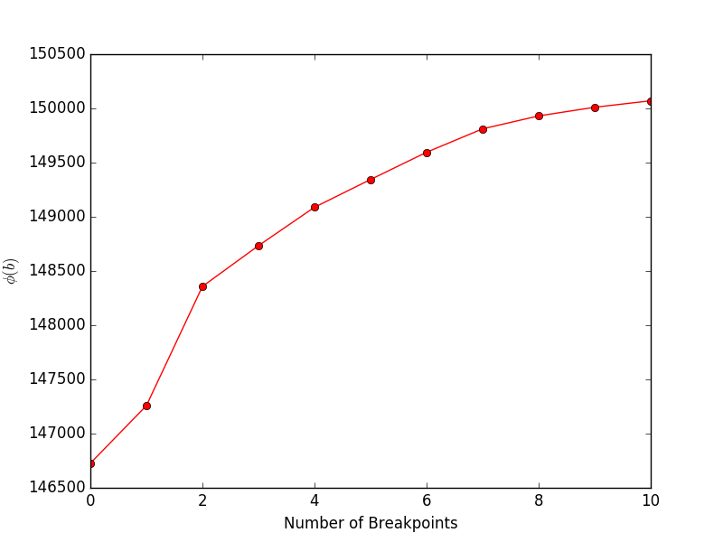
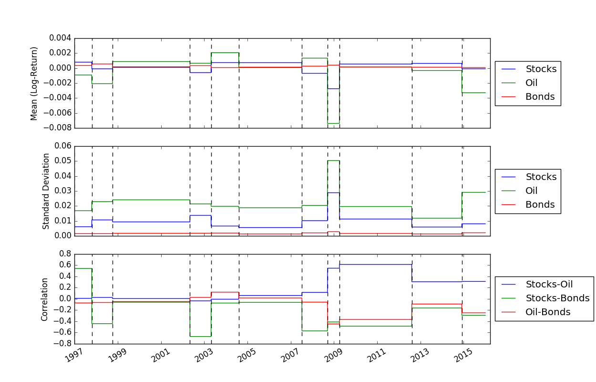
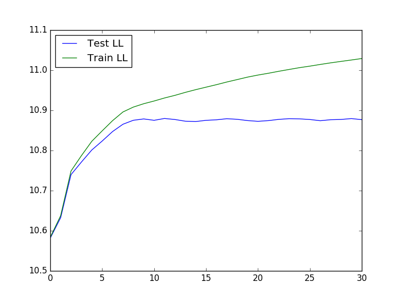

# GGS
Greedy Gaussian Segmentation (GGS) is a Python solver for efficiently segmenting multivariate time series data. For implementation details, please see our paper at [http://stanford.edu/~boyd/papers/ggs.html](http://stanford.edu/~boyd/papers/ggs.html).

----

The GGS Solver takes a T-by-n data matrix and breaks the T timestamps on an n-dimensional vector into segments over which the data is well explained as independent samples from a multivariate Gaussian distribution. It does so by formulating a covariance-regularized maximum likelihood problem and solving it using a greedy heuristic, with full details described in the [paper](http://stanford.edu/~boyd/papers/ggs.html).


Download & Setup
======================

  1. Download the source code in the terminal by running:
```
git clone git@github.com:davidhallac/GGS.git
```
  2. Confirm that the code was properly downloaded by running:
```
cd GGS
python helloworld.py
```
  3. To write your own Python function that uses ggs, simply make sure that `ggs.py` is in the same directory as your new file, and then add the following code to the beginning of your script:
```
from ggs import *
```


Supported Functions
======================

The GGS package has three main functions:

```
bps, objectives = GGS(data, Kmax, lamb)
```

Finds K breakpoints in the data for a given regularization parameter lambda

**Inputs**

data - a T-by-n data matrix, with T timestamps of an n-dimensional vector

Kmax - the number of breakpoints to find

lamb - regularization parameter for the regularized covariance

**Returns**

bps - List of lists, where element *i* of the larger list is the set of breakpoints found at *K = i* in the GGS algorithm

objectives - List of the objective values at each intermediate step (for *K =* 0 to Kmax)


----

```
meancovs = GGSMeanCov(data, breakpoints, lamb)
```

Finds the means and regularized covariances of each segment, given a set of breakpoints.

**Inputs**

data - a T-by-n data matrix, with T timestamps of an n-dimensional vector

breakpoints - a list of breakpoint locations

lamb - regularization parameter for the regularized covariance

**Returns**

meancovs - a list of (mean, covariance) tuples for each segment in the data

----


```
cvResults = GGSCrossVal(data, Kmax=25, lambList = [0.1, 1, 10])
```

Runs 10-fold cross validation, and returns the train and test set likelihood for every (K, lambda) pair up to Kmax

**Inputs**

data - a T-by-n data matrix, with T timestamps of an n-dimensional vector

Kmax - the maximum number of breakpoints to run GGS on

lambList - a list of regularization parameters to test

**Returns**

cvResults - list of (lamb, ([TrainLL],[TestLL])) tuples for each regularization parameter in lambList. Here, TrainLL and TestLL are the average per-sample log-likelihood across the 10 folds of cross-validation for all *K*'s from 0 to Kmax

----

Additional optional parameters (for all three functions above): 

features = [] - select a certain subset of columns in the data to operate on
verbose = False - Print intermediate steps when running the algorithm


Example Usage
======================

Running `helloworld.py` will yield the following plot, showing the objective (Equation 4 in the paper) vs. the number of breakpoints:



Once we have solved for the locations of the breakpoints, we can use the `FindMeanCovs()` function to find the means and covariances of each segment. In the example in `helloworld.py`, plotting the means, variances, and covariances of the three signals yields:



To run cross-validation, which can be useful in determining optimal values of K and lambda, we can use the following code to load the data, run the cross-validation, and then plot the test and train likelihood:
```
from ggs import *
import numpy as np
import matplotlib.pyplot as plt

filename = "Returns.txt"
data = np.genfromtxt(filename,delimiter=' ')
feats = [0,3,7]

#Run cross-validaton up to Kmax = 30, at lambda = 1e-4
maxBreaks = 30
lls = FindHyperparams(data, Kmax=maxBreaks, lambList = [1e-4], features = feats, verbose = False)

trainLikelihood = lls[0][1][0]
testLikelihood = lls[0][1][1]
plt.plot(range(maxBreaks+1), testLikelihood)
plt.plot(range(maxBreaks+1), trainLikelihood)
plt.legend(['Test LL','Train LL'], loc='best')
plt.show()
```
The resulting plot looks like:




References
==========
[Greedy Gaussian Segmentation of Time Series Data -- D. Hallac, P. Nystrup, and S. Boyd][ggs]


[ggs]: http://stanford.edu/~boyd/papers/ggs.html "Greedy Gaussian Segmentation of Time Series Data -- D. Hallac, P. Nystrup, and S. Boyd"


Authors
------
David Hallac, Peter Nystrup, and Stephen Boyd.


